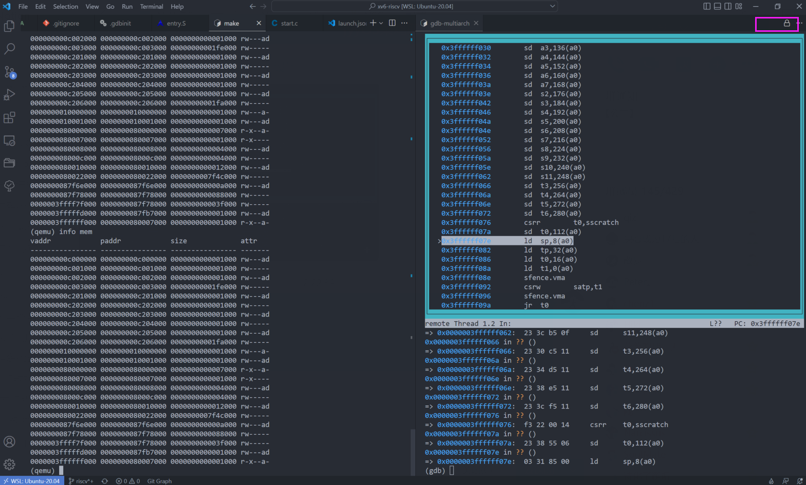
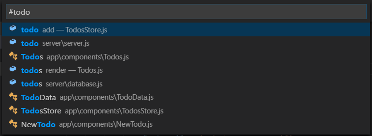

# VSCode 配置

[toc]

## TIPS

> **[VScode快捷键(最全)](https://adong.blog.csdn.net/article/details/121996966?spm=1001.2101.3001.6661.1&utm_medium=distribute.pc_relevant_t0.none-task-blog-2%7Edefault%7ECTRLIST%7ERate-1-121996966-blog-100094155.t0_edu_mix&depth_1-utm_source=distribute.pc_relevant_t0.none-task-blog-2%7Edefault%7ECTRLIST%7ERate-1-121996966-blog-100094155.t0_edu_mix&utm_relevant_index=1)**

### 使用技巧

**[锁定组](https://christianheilmann.com/2021/09/08/locking-editor-panes-in-visual-studio-code-helps-unwanted-multi-tab-experiences/)**：The locked group then shows a lock icon and no other files will open as tabs on it, even if it had the focus. 

相当于保持改页面作为最“顶”层，不会被新打开的页面覆盖。

通常打开终端，将其拖到右边，并锁定组如上图右上角有个🔒，那么就能保持终端不会吧别的页面覆盖。

## 快捷键

### 查找

- **查找文件：**`ctrl + p`
- **全局查找文件：**`ctrl + shift + f`
- **显示相关插件的命令**：`ctrl + shift + p`（遇事不决就按）
- **跳转至符号处：**`ctrl + shift + o`

> 冒号来进行分组：`@:`

**工作区符号跳转：`Ctrl + t`(下图所示)**

### 光标移动

- **按word移动光标：**`Ctrl + ←/→`
- **跳转行头/尾巴**：`Home`/`End`→ `ctrl + ;` /`ctrl + '`
- **移动一整行**：`alt+up/down`

### 基础编辑 Basic editing

- **选中文字**：`shift + left / right / up / down`
- **单行注释**：`ctrl+/`
- **删除当前行**：`ctrl+shift+k` → `ctrl+d`
- **删除上一个词**：`Ctrl + backspace`
- **行增加/减少缩进:** `ctrl + [` /`ctrl + ]`
- **显示/隐藏左侧目录栏：** `ctrl + b`
- **控制台终端显示与隐藏**：`ctrl + ~`
- **全局替换：**`ctrl + shift + h`
- **在当前行之前/后插入一行**：`Ctrl+Enter` /  `Ctrl+Shift+Enter`
- **格式化代码**：`Shift + Alt + F`

### 编辑/窗口管理

|     快捷键     |             作用             |
| :------------: | :--------------------------: |
| Ctrl + Shift+N |          打开新窗口          |
|     Ctrl+W     |           关闭窗口           |
|    Ctrl+F4     |       关闭当前编辑窗口       |
|    Ctrl+K F    |     关闭当前打开的文件夹     |
|    Ctrl+ \     | 拆分编辑器（最多拆分为三块） |
|   Ctrl+1/2/3   |   切换焦点在不同的拆分窗口   |
|    ctrl+Tab    |         切换工作窗口         |

## 插件

- **Reload**：重启软件
- **Auto Rename Tag**：修改html标签，自动帮你完成尾部闭合标签的同步修改，和webstorm一样。
- **Material Icon Theme**：让文件夹图标好看😍
- **One Dark Pro**：暗黑主题
- **Git Graph**：在VSCode可视化 Git 版本情况