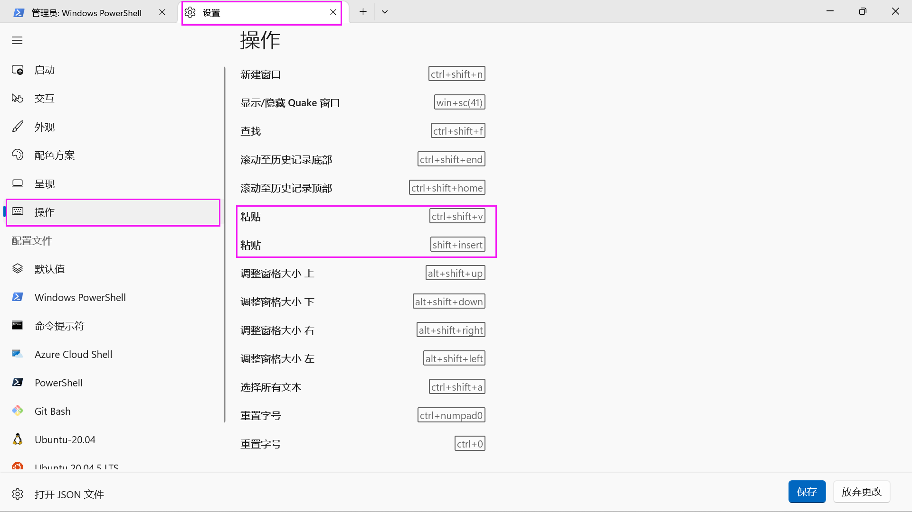

# Vim

[toc]


## 快捷键

## 插入

> 在 Windows Terminal 中 `ctrl+v` 被绑定为贴贴只需要在其配置文件中将 `ctrl+v` 的绑定删去即可，否则在vim模式下按 `ctrl+v` 便是贴贴操作。
>
> 

- `ctrl+v` 进入块visual模式，然后按大写的 `I` 也就是 `shift+i` 直接在行首插入。

## 移动

- `%`：括号匹配，能在括号间跳换
- `^`行首 `$`行尾 （考虑正则表达式）
- 大写W 无视单词中的符号，直接跳转下一个单词，小写w则不会无视符号
- `fx`跳转到第一个出现 x 的位置，`tx` 跳转到出现 x 位置前面
- `ctrl+i`：向前跳转到最近的光标位置
- `ctrl+o`：向后跳转到之前光标所在的位置。

### 选中

- `viw` 和 `bve`选中一个单词
- `vi<`：选择尖括号里面的内容
- `va<`：选择（包括）尖括号里面的内容

### 其他

- `ZZ`： 使用ZZ命令时，如果文件已经做过编辑处理，则把内存缓冲区中的数据写到启动vim时指定的文件中，然后退出vim编辑器。否则只是退出vim而已。
- `*` 进入当前单词的向下查找模式
- `#` 进入当前单词的向上查找模式

### 正则表达式

- `s/\s*$//g`：删去行尾有空格，trailing whitespace
- `s/ /\\r /g`：将空格$\to$换行

```bash
# 观察一个makefile过程
make -nB \
  | grep -ve '^\(\#\|echo\|mkdir\|make\)' \
  | sed "s#$AM_HOME#\$AM_HOME#g" \
  | sed "s#$PWD#.#g" \
  | vim -
```

- Command line tricks
  - `make -nB` (RTFM)
  - grep: 文本过滤，省略了一些干扰项
    - echo (提示信息), mkdir (目录建立), make (sub-goals)
  - sed: 让输出更易读
    - 将绝对路径替换成相对路径
  - vim: 更舒适的编辑/查看体验

## 配置

- `set et`：把 tab 换成空格样式
- `filetype indent on`：特定的文件类型载入缩进文件

