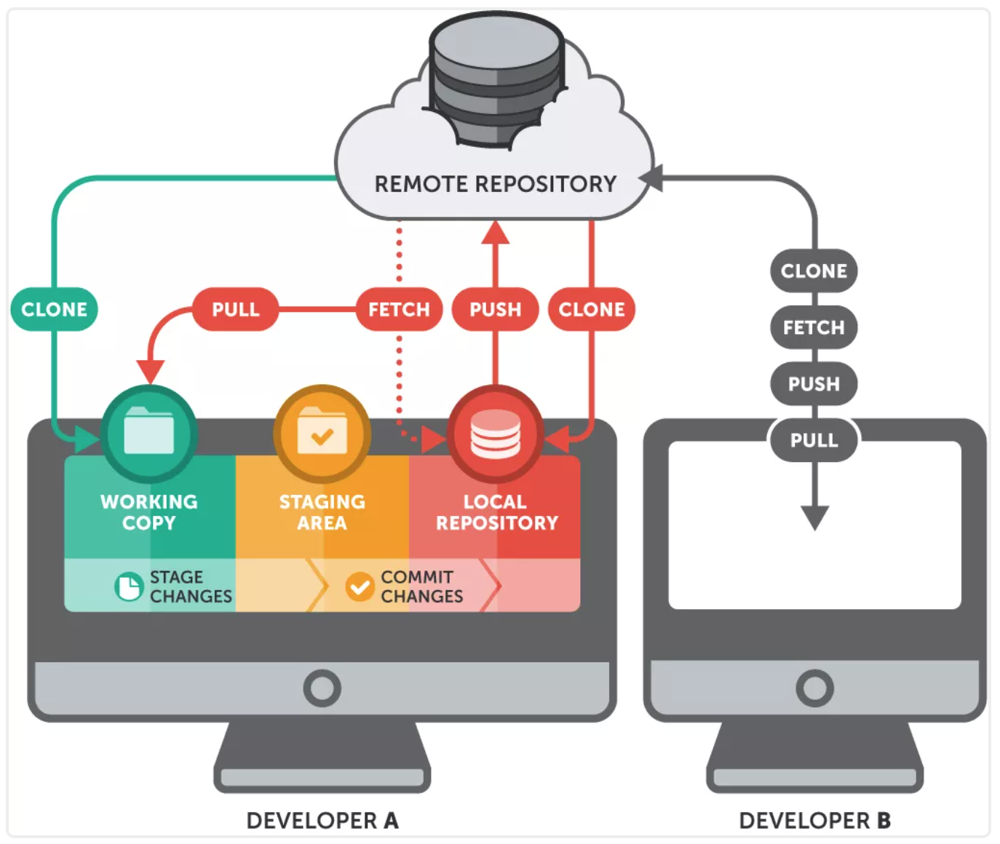

# Git

[toc]



Git会有三个区域：

- **Working Tree** 当前的工作区域
- **Index/Stage** 暂存区域，和git stash命令暂存的地方不一样。使用git add x，就可以将x添加近Stage里面
- **Repository** 提交的历史，即使用git commit提交后的结果

## Git 使用规范流程

下面是[ThoughtBot](https://github.com/thoughtbot/guides/tree/master/protocol/git) 的Git使用规范流程。


### Commit 提交规范

目前业界比较流行的commit规范, 主要包括三部分:

- header
- body
- footer 完整格式如下:

```xml
<type>(<scope>): <subject>
<blank line>

<body>
<blank line>
<footer>
```

### type

提交的commit类型, 包括以下几种:

- feat: 新功能
- fix: 修复问题
- docs: 修改文档
- style: 修改代码格式, 不影响代码逻辑
- refactor: 重构代码, 理论上不影响现有功能
- perf: 提升性能
- test: 增加修改测试用例
- chore: 修改工具相关(包括但不限于文档, 代码生成等)

## 资料

- [Git 从入门到精通，这一篇就够了](https://mp.weixin.qq.com/s/b8bQW2N5VC-qmGD4dTiwKQ)

### 命令

- [常用 Git 命令清单](http://www.ruanyifeng.com/blog/2015/12/git-cheat-sheet.html)

- [Git远程操作详解](http://www.ruanyifeng.com/blog/2014/06/git_remote.html)

- [阮一峰 Git 教程](https://www.bookstack.cn/books/git-tutorial)
- [git rebase，看这一篇就够了](https://juejin.cn/post/6969101234338791432)
- [谭新宇 git-tips](https://github.com/OneSizeFitsQuorum/git-tips#%E6%88%91%E7%9A%84-alias-%E8%AE%BE%E7%BD%AE)

---

### 规范使用

- [Git 使用规范流程](http://www.ruanyifeng.com/blog/2015/08/git-use-process.html)
- [Git分支管理策略](http://www.ruanyifeng.com/blog/2012/07/git.html)
- [Git工作流和教程](https://github.com/oldratlee/translations/tree/master/git-workflows-and-tutorials)