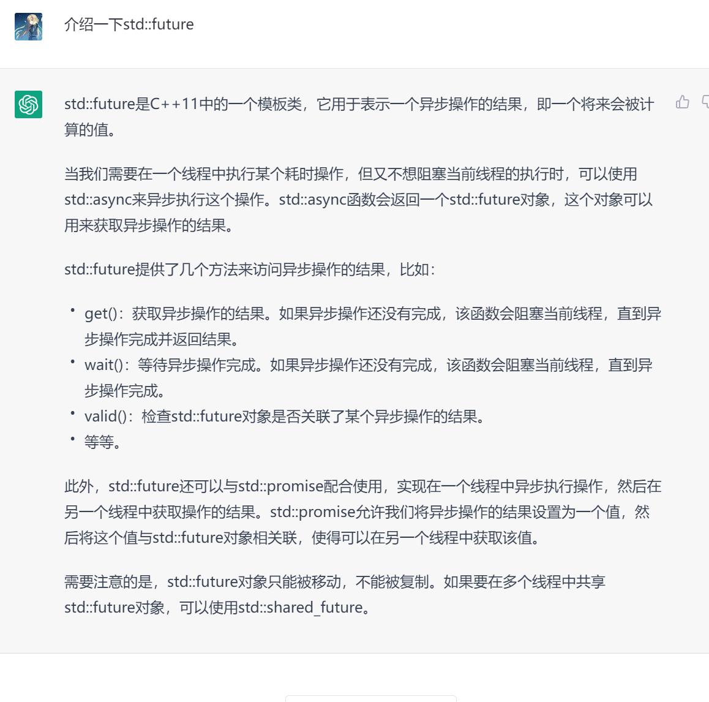

[toc]

## 时间

### std::chrono

利用 C++ 强类型的特点，明确区分**时间点**与**时间段**，明确区分不同的**时间单位**。

方便的运算符重载：时间点 + 时间段=时间点，时间点 - 时间点 = 时间段

- 时间点类型：`chrono::steady_clock::time_point` 等
- 时间段类型：`chrono::milliseconds`，`chrono::seconds`，`chrono::minutes` 等

> duration_cast 可以在任意的 duration 类型之间转换，duration<T, R> 表示用 T 类型表示，且时间单位是 R（R 省略不写就是秒，std::milli 就是毫秒，std::micro 就是微秒）

### std::this_thread::sleep_for

- std::this_thread::sleep_for：让当前线程休眠一段时间，然后继续。
- std::this_thread::sleep_until：让当前线程休眠直到某个时间点

```c++
#include <iostream>
#include <thread>
#include <chrono>

int main() {
  {
    /** 计算花费的时间 **/
    auto t0 = std::chrono::steady_clock::now();  // 获取当前时间
    for (volatile int i = 0; i < 10000000; i++); // 计算
    auto t1 = std::chrono::steady_clock::now();  // 获取两个时间点的差（时间段）
    auto dt = t1 - t0;
    int64_t ms = std::chrono::duration_cast<std::chrono::milliseconds>(dt).count(); // 时间差的秒数
    std::cout << "time elapsed: " << ms << " ms" << std::endl;
  }
  {
    /** 计算花费的时间 作为 double 类型 **/
    auto t0 = std::chrono::steady_clock::now();
    for (volatile int i = 0; i < 10000000; i++);
    auto t1 = std::chrono::steady_clock::now();
    auto dt = t1 - t0;
    using double_ms = std::chrono::duration<double, std::milli>;
    double ms = std::chrono::duration_cast<double_ms>(dt).count();
    std::cout << "time elapsed: " << ms << " ms" << std::endl;
  }
  {
    /** 睡眠 **/
  	std::this_thread::sleep_for(std::chrono::milliseconds(400));
  	auto t = std::chrono::steady_clock::now() + std::chrono::milliseconds(400);
  	std::this_thread::sleep_until(t);
  }
  return 0;
}
```

## 线程

### std::thread

std::thread 构造函数的参数可以是任意 lambda 表达式。

- **主线程等待子线程结束**：`t1.join()`

- **std::thread** **的解构函数会销毁线程**

作为一个 C++ 类，std::thread 同样遵循 RAII 思想和三五法则：因为管理着资源，他自定义了**解构函数**，删除了**拷贝构造/赋值函数**，但是提供了**移动构造/赋值函数**。

### 析构函数不销毁线程

- **析构函数不再销毁线程**：`t1.detach()`
- **析构函数不再销毁线程：移动到全局线程池**

调用成员函数 detach() 分离该线程——意味着线程的生命周期**不再由当前 std::thread 对象管理**，而是在线程退出以后自动销毁自己。

但是 detach 的问题是进程退出时候不会等待所有子线程执行完毕。所以另一种解法是把 t1 对象**移动**（std::move）到一个全局变量。

### 主线程主动join

- **main** **函数退出后自动** **join** **全部线程**

在 main 里面手动 join 全部线程，还是有点麻烦，我们可以自定义一个类 ThreadPool，并用他创建一个全局变量，其析构函数会在 main 退出后自动调用。

- **std::jthread：符合 RAII 思想，解构时自动 join()**

C++20 引入了 std::jthread 类，和 std::thread 不同在于：他的解构函数里会自动调用 join() 函数，从而保证 pool 解构时会自动等待全部线程执行完毕。

## 异步

### std::async

- std::async 接受一个带返回值的 lambda，自身返回一个 std::future 对象。
- lambda 的函数体将在**另一个线程**里执行。
- 接下来你可以在 main 里面做一些别的事情，download 会持续在后台悄悄运行。
- 最后调用 future 的 get() 方法，如果此时 download 还没完成，会**等待** download 完成，并获取 download 的返回值



```c++
#include <iostream>
#include <string>
#include <thread>
#include <future>

int download(std::string file) {
  for (int i = 0; i < 10; i++) {
    std::cout << "Downloading " << file
              << " (" << i * 10 << "%)..." << std::endl;
    std::this_thread::sleep_for(std::chrono::milliseconds(400));
  }
  std::cout << "Download complete: " << file << std::endl;
  return 404;
}

void interact() {
  std::string name;
  std::cin >> name;
  std::cout << "Hi, " << name << std::endl;
}

int main() {
  std::future<int> fret = std::async([&] {
    return download("hello.zip"); 
  });
  interact();
  int ret = fret.get();
  std::cout << "Download result: " << ret << std::endl;
  return 0;
}
```

**std::launch::deferred 做参数**

- std::async 的第一个参数可以设为 std::launch::deferred，这时不会创建一个线程来执行，他只会把 lambda 函数体内的运算**推迟**到 future 的 get() 被调用时。也就是 main 中的 interact 计算完毕后。

**std::async 的底层实现 std::promise**

- 如果不想让 std::async 帮你自动创建线程，想要手动创建线程，可以直接用 std::promise。
- 然后在线程返回的时候，用 set_value() 设置返回值。在主线程里，用 get_future() 获取其 std::future 对象，进一步 get() 可以等待并获取线程返回值。

```c++
int main() {
  std::promise<int> pret;
  std::thread t1([&] {
    auto ret = download("hello.zip");
    pret.set_value(ret); 
  });
  std::future<int> fret = pret.get_future();

  interact();
  int ret = fret.get();
  std::cout << "Download result: " << ret << std::endl;

  t1.join();
  return 0;
}
```

### 等待：wait() 和 wait_for()

除了 get() 会等待线程执行完毕外，wait() 也可以等待他执行完，但是不会返回其值，只要线程没有执行完，wait() 会无限等下去。

wait_for() 则可以指定一个最长等待时间，用 chrono 里的类表示单位。他会返回一个std::future_status 表示等待是否成功。

- 如果超过这个时间线程还没有执行完毕，则放弃等待，返回 future_status::timeout。

- 如果线程在指定的时间内执行完毕，则认为等待成功，返回 future_status::ready。

## 互斥量

### std::mutex

- lock()
- unlock()

### RAII：std::lock_guard 和 std::unique_lock

符合 RAII 思想的上锁和解锁

std::lock_guard 就是这样一个工具类，他的构造函数里会调用 mutex.lock()，析构函数会调用 mutex.unlock()。

---

**相比于 std::lock_guard，std::unique_lock 能主动释放锁**

std::lock_guard 严格在解构时 unlock()，但是有时候我们会希望提前 unlock()。这时可以用 std::unique_lock，他额外存储了一个 flag 表示是否已经被释放。他会在解构检测这个 flag，如果没有释放，则调用 unlock()，否则不调用。

**std::defer_lock** **作为参数**

- std::unique_lock 的构造函数还可以有一个额外参数 std::defer_lock。

- 指定了这个参数的话，std::unique_lock **不会**在构造函数中调用 mtx.lock()，需要之后再**手动调用** grd.lock() 才能上锁。

**用** **std::try_to_lock 做参数**

- 和无参数相比，他会调用 mtx1.try_lock() 而不是 mtx1.lock()。之后，可以用 grd.owns_lock() 判断是否上锁成功。

**std::unique_lock：用 std::adopt_lock 做参数**

- 如果当前 mutex 已经上锁了，但是之后仍然希望用 RAII 思想在解构时候自动调用

  unlock()，可以用 std::adopt_lock 作为 std::unique_lock 或 std::lock_guard 的第二个参数，这时他们会默认 mtx 已经上锁。

### try_lock() 和 try_lock_for()

- try_lock()，他在上锁失败时不会陷入等待，而是直接返回 false；如果上锁成功，则会返回 true。

- 如果需要等待，但仅限一段时间，可以用 std::timed_mutex 的 try_lock_for() 函数，他的参数是最长等待时间，同样是由 chrono 指定时间单位。

### std::lock 和 std::scoped_lock

- 标准库的 std::lock(mtx1, mtx2, ...) 函数，一次性对多个 mutex 上锁

- 他接受任意多个 mutex 作为参数，并且他保证在无论任意线程中调用的顺序是否相同，都不会产生死锁问题。
- 和 std::lock_guard 相对应，std::lock 也有RAII 的版本 std::scoped_lock。

### std::recursive_mutex

> **同一个线程重复调用 lock() 也会造成死锁**

std::recursive_mutex。他会自动判断是不是同一个线程 lock() 了多次同一个锁，如果是则让计数器加1，之后 unlock() 会让计数器减1，减到0时才真正解锁。但是相比普通的 std::mutex 有一定性能损失。

## 数据结构

**多线程环境中使用 std::vector**

由于 std::vector 会动态扩容，移动地址，因此多个线程同时访问同一个 vector 会出现**数据竞争**（data-race）现象。

### std::shared_mutex 

在读取数据，不涉及修改数据，因此可以和别人共享一起读取数据。

共享锁，上锁时，要指定你的需求，负责调度的读写锁会帮你判断要不要等待。

### RAII：std::shared_lock

正如 std::unique_lock 针对 lock()，也可以用 std::shared_lock 针对 lock_shared()。这样就可以在函数体退出时自动调用 unlock_shared()，更加安全了。

## 条件变量

`std::condition_variable` 必须和 `std::unique_lock<std::mutex>` 配合使用

### cv.wait(lock)

```c++
// 等待在条件变量上
while(!checkCompability()){
  cv.wait(lock)
}
// 另一种写法
cv.wait(lock,[&](){
  return checkCompability();
})
```

### cv.notify_one()

### cv.notify_all() 

### 生产者消费者

```c++
#include <iostream>
#include <thread>
#include <vector>
#include <mutex>
#include <condition_variable>

int main() {
  std::condition_variable cv;
  std::mutex mtx;

  std::vector<int> foods;

  std::thread t1([&] {
    for (int i = 0; i < 2; i++) {
      std::unique_lock lck(mtx);
      cv.wait(lck, [&] {
        return foods.size() != 0;
      });
      auto food = foods.back();
      foods.pop_back();
      lck.unlock();

      std::cout << "t1 got food:" << food << std::endl;
    }
  });

  std::thread t2([&] {
    for (int i = 0; i < 2; i++) {
      std::unique_lock lck(mtx);
      cv.wait(lck, [&] {
        return foods.size() != 0;
      });
      auto food = foods.back();
      foods.pop_back();
      lck.unlock();

      std::cout << "t2 got food:" << food << std::endl;
    }
  });

  foods.push_back(42);
  foods.push_back(233);
  cv.notify_one();

  foods.push_back(666);
  foods.push_back(4399);
  cv.notify_all();

  t1.join();
  t2.join();

  return 0;
}
```

## 原子操作

### std::atomic\<int\>

### fetch_add

### exchange

- exchange(val) 会把 val 写入原子变量，同时返回其旧的值。

### compare_exchange_strong

compare_exchange_strong(old, val) 会读取原子变量的值，比较他是否和 old 相等：

- 如果不相等，则把原子变量的值写入 old。

- 如果相等，则把 val 写入原子变量。

```c++
/** 方便理解的伪代码 **/
template <class T>
struct atomic {
  std::mutex mtx;
  int cnt;

  int store(int val) {
    std::lock_guard _(mtx);
    cnt = val;
  }

  int load() const {
    std::lock_guard _(mtx);
    return cnt;
  }

  int fetch_add(int val) {
    std::lock_guard _(mtx);
    int old = cnt;
    cnt += val;
    return old;
  }

  int exchange(int val) {
    std::lock_guard _(mtx);
    int old = cnt;
    cnt = val;
    return old;
  }

  bool compare_exchange_strong(int &old, int val) {
    std::lock_guard _(mtx);
    if (cnt == old) {
      cnt = val;
      return true;
    } else {
      old = cnt;
      return false;
    }
  }
};
```

## 资料

- [【公开课】C++11开始的多线程编程（#5）](https://www.bilibili.com/video/BV1Ya411q7y4/?spm_id_from=333.1007.top_right_bar_window_history.content.click&vd_source=389a82d53180517ed861b876f0a6ce60)

- [PPT + Code](https://github.com/parallel101/course)