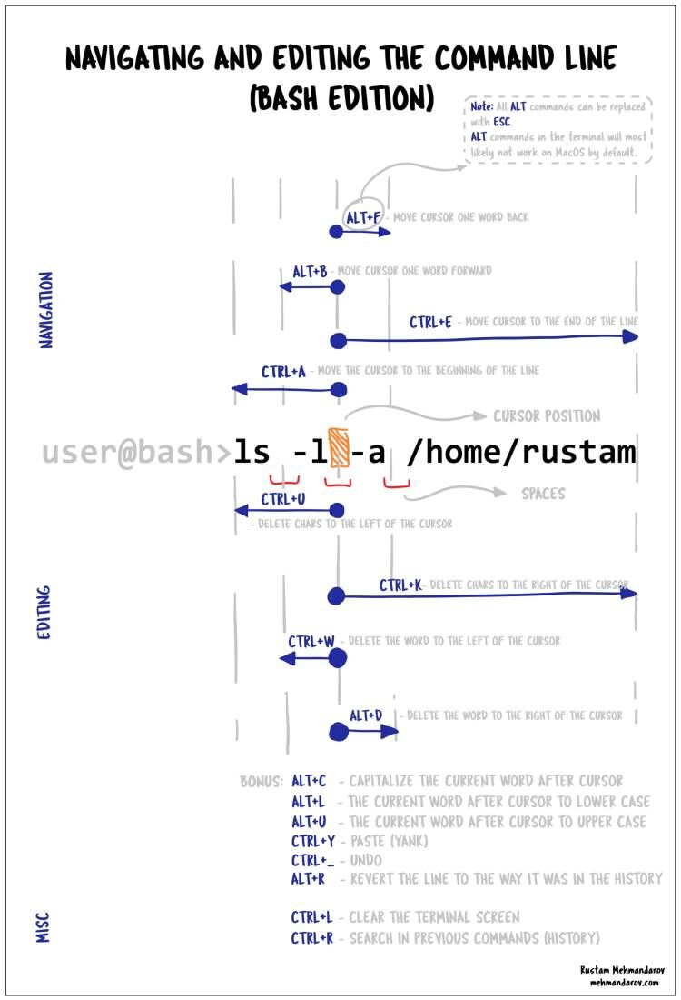

## 快捷键

**移动**

- `Alt + f`：光标向前（Forward）移动到下一个单词。
- `Alt + b`：光标往回（Backward）移动到前一个单词。
- `Ctrl + e`：光标移动到行尾（End of line）

- `Ctrl + a`：光标移动到行首（Beginning of line）

**编辑**

- `Ctrl + u`：删除光标所在位置左边与行首之间的所有字符。
- `Ctrl + k`：删除光标所在位置与行尾之间的所有字符。

- `Ctrl + w`：删除光标所在位置前任意个空格及其前的一个单词，或光标所在位置左边至所在单词首的所有字符。
- `Alt + d`：删除光标所在位置后任意个空格及其后的一个单词，或光标所在位置至所在单词尾的所有字符。

**Bonus**

- `ALT + C` ：终止正在运行的命令/进程。与 `Ctrl + C` 相同。

- `Alt + l`：转换光标所在位置后的一个单词为**小写**，或光标所在单词位置至此单词尾的字母为**小写**。

- `Alt + u`：转换光标所在位置后的一个单词为**大写**，或光标所在单词位置至此单词尾的字母为**大写**。
- `Ctrl + y`： 粘贴或者恢复上次的删除。
- `Ctrl + _`：Undo
- `Alt + R` ：撤销对从历史记录中带来的命令的修改。正如你在上面输出所见，我使用反向搜索拉取了一个指令，并更改了那个指令的最后一个字母，并使用 `Alt + R` 撤销了更改。

**MISC**

- `Ctrl + l`：清屏，相当于执行 clear 命令。
- `Ctrl + r`：依据用户在，提示符后的输入字符串匹配查找 history 记录中命令条目。